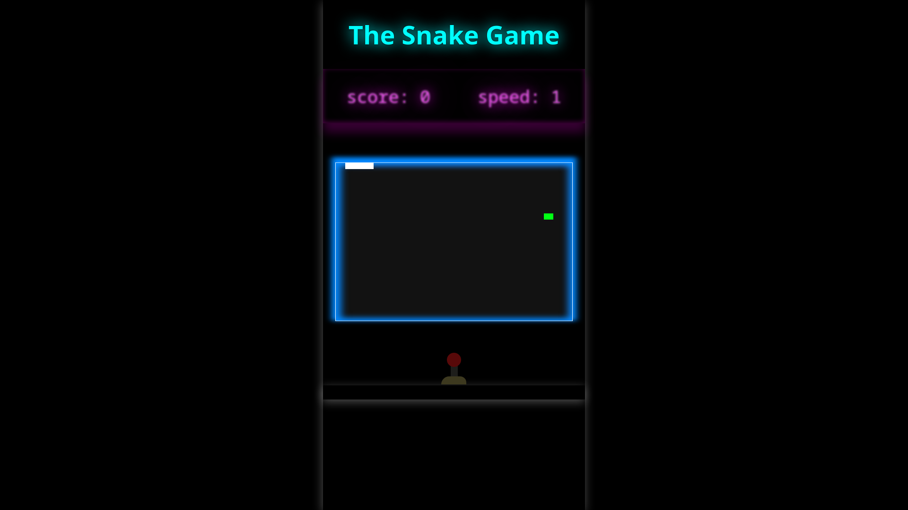

# Snake Game

### First download from the repository

### install all dependencies

```bash
$ git clone https://github.com/Soni295/Snake-Game.git
$ cd Snake-Game
$ npm install
```

### use it which compile all file ".ts"

```bash
$  npm run build
```

### and finally <code>$ npm start</code> for start the server on port 3000

```bash
$ npm run start
```

## Controls

- arrow Up
- arrow Down
- arrow Left
- arrow Right
- P for pause the game

## Gameplay

- You can select the speed when starting.
- According to the difficulty, the points received per block are higher.
- The speed will gradually increase.

[Click here to start](https://soni295.github.io/Snake-Game/)


